# Workday Autofill - Visual Flow Diagram

## 🔄 Complete Flow Diagram


## 📊 Network Monitoring Detail

```mermaid
sequenceDiagram
    participant User
    participant Extension
    participant Workday
    participant Monitor
    
    User->>Extension: Fill Country = "United States"
    Extension->>Workday: Change event + Blur
    Workday->>Workday: Validates Country
    
    activate Monitor
    Note over Monitor: Start Network Monitoring
    
    Workday->>Workday: API Call 1: Get States
    Monitor->>Monitor: Track: 1 pending request
    
    Workday->>Workday: API Call 2: Get Fields Config
    Monitor->>Monitor: Track: 2 pending requests
    
    Workday-->>Workday: Response 1: States loaded
    Monitor->>Monitor: Track: 1 pending request
    
    Workday-->>Workday: Response 2: Fields loaded
    Monitor->>Monitor: Track: 0 pending requests
    
    Monitor->>Monitor: Wait 500ms (ensure quiet)
    Note over Monitor: Network is Quiet ✓
    deactivate Monitor
    
    Monitor-->>Extension: ✅ Safe to continue
    Extension->>Extension: Re-scan DOM
    Extension->>Extension: Fill remaining fields
```



## 🆚 Comparison: Smart Wait vs Fixed Wait

```mermaid
gantt
    title Filling Time Comparison
    dateFormat X
    axisFormat %Ss
    
    section Smart Wait (Network Monitoring)
    Fill Country       :a1, 0, 1s
    Wait for Network   :a2, 1s, 3s
    Re-scan DOM        :a3, 4s, 1s
    Fill Other Fields  :a4, 5s, 5s
    Complete           :milestone, 10s, 0s
    
    section Fixed 5s Wait (Old Way)
    Fill Country       :b1, 0, 1s
    Fixed Wait 5s      :b2, 1s, 5s
    Re-scan DOM        :b3, 6s, 1s
    Fill Other Fields  :b4, 7s, 5s
    Complete           :milestone, 12s, 0s
```

**Result:** 
- ✅ Smart Wait: **10 seconds** (adapts to actual network speed)
- ❌ Fixed Wait: **12 seconds** (always waits full 5s, even if network is ready in 2s)

## 🎯 Field Priority System


## 🔍 Field Matching Priority

```mermaid
flowchart TD
    A[Need to Fill Field: 'Country'] --> B{Has data-automation-id?}
    
    B -->|Yes| C[Match by automation-id]
    C --> D{Found?}
    D -->|Yes| E[✅ Use This Element]
    D -->|No| F[Try Text Matching]
    
    B -->|No| F
    F --> G{Text Match Found?}
    G -->|Yes| E
    G -->|No| H[❌ Report Failed]
    
    style C fill:#4CAF50,color:#fff
    style F fill:#FF9800,color:#fff
    style E fill:#4CAF50,color:#fff
    style H fill:#f44336,color:#fff
```



## 📱 Platform Detection

```mermaid
flowchart TD
    A[Application URL Loaded] --> B{Check URL}
    
    B -->|Contains 'myworkdayjobs.com'| C[✅ Workday]
    B -->|Contains 'myworkday.com'| C
    B -->|Other| D{Check DOM}
    
    D -->|Has data-automation-id| C
    D -->|No data-automation-id| E[Standard Platform]
    
    C --> F[Use WorkdayHandler]
    E --> G[Use Standard Handler]
    
    style C fill:#4CAF50,color:#fff
    style F fill:#4CAF50,color:#fff
    style G fill:#2196F3,color:#fff
```



---

## 💡 Key Insights from Diagrams

1. **Network Monitoring is Asynchronous** - Doesn't block, just waits intelligently
2. **Priority System Ensures Correct Order** - Country MUST be filled before other fields load
3. **Re-scanning is Critical** - The DOM literally has more elements after country selection
4. **Multiple Fallbacks** - automation-id → text match → report failure
5. **Time Savings** - Smart waiting saves 2+ seconds on average

---

**Total Time to Fill Workday Application:**
- Old approach: ~12-15 seconds
- **New approach: ~8-10 seconds** ⚡

